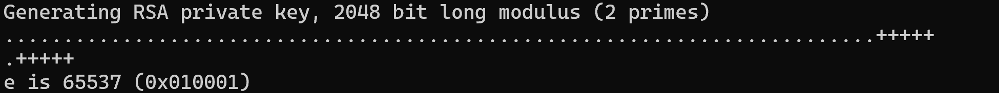
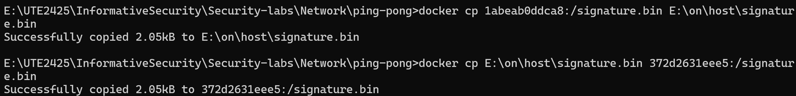
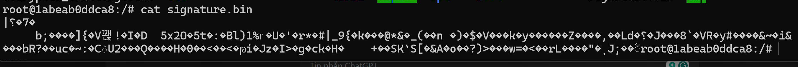
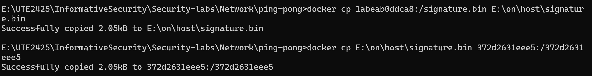
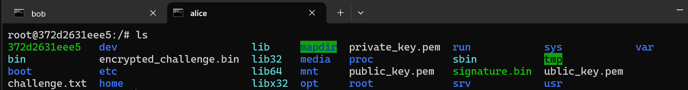

# Task 1: Public-key based authentication 
**Question 1**: 
Implement public-key based authentication step-by-step with openssl according the following scheme.


**Answer 1**:

Access to Docker and create to virtual server

We have to servers:


Update and install openssl 

```apt update && apt install -y openssl```

Create 2 keys (public & private) 

Alice create a private key

``` openssl genrsa -out private_key.pem 2048```

openssl: A command-line tool used for working with SSL/TLS and cryptography.

genrsa: Generates an RSA private key.

-out private_key.pem: Specifies where to save the generated private key, in this case, the file client_private_key.pem.

2048: The length (in bits) of the RSA key. 2048-bit is a common security standard.


Export Public key

```openssl rsa -in private_key.pem -pubout -out public_key.pem ```

openssl: A command-line tool used for working with SSL/TLS and cryptography.

rsa: A command used to process RSA keys.
-in client_private_key.pem: Specifies the file containing the previously generated RSA private key (in this case, client_private_key.pem).

-pubout: Indicates that you want to extract and output the public key from the private key.

-out public_key.pem: Specifies where to save the extracted public key (in this case, client_public_key.pem).
Create a message in Alice

Create a challenge message in Alice

``` echo "challenge_message" > challenge.txt ```


``` openssl rsautl -encrypt -inkey client_public_key.pem -pubin -in challenge.txt -out encrypted_challenge.bin ```
rsautl: A command used to perform operations with RSA, including encryption and decryption.

-encrypt: This operation specifies that you want to encrypt the data.

-inkey client_public_key.pem: Specifies the file containing the RSA public key used to encrypt the data.

-pubin: Indicates that the input key is a public key. This helps OpenSSL understand that the key will be used for encryption.

-in challenge.txt: Specifies the file containing the data to be encrypted (in this case, challenge.txt).

-out encrypted_challenge.bin: Specifies the output file where the encrypted data will be stored (in this case, encrypted_challenge.bin).

Send the key to the Bob
``` docker cp 372d2631eee5:encrypted_challenge.bin E:\on\host\encrypted_challenge.bin```

``` docker cp E:\on\host\encrypted_challenge.bin 1abeab0ddca8:/encrypted_challenge.bin```

```docker cp E:\on\host\private_key.pem 1abeab0ddca8:/private_key.pem ```

```docker cp E:\on\host\private_key.pem 1abeab0ddca8:/private_key.pem ```

The result


In bob

``` openssl rsautl -decrypt -inkey private_key.pem -in encrypted_challenge.bin -out decrypted_challenge.txt ```

Sign challenge to encrypt

```openssl dgst -sha256 -sign client_private_key.pem -out signature.bin decrypted_challenge.txt```



Then send the signature from Bob back to Alice 


then Alice receive it



```openssl dgst -sha256 -verify public_key.pem -signature signature.bin decrypted_challenge.txt ```

# Task 2: Encrypting large message 
Create a text file at least 56 bytes.

**Question 1**:
Encrypt the file with aes-256 cipher in CFB and OFB modes. How do you evaluate both cipher as far as error propagation and adjacent plaintext blocks are concerned. 

**Answer 1**:

**Question 2**:
Modify the 8th byte of encrypted file in both modes (this emulates corrupted ciphertext).
Decrypt corrupted file, watch the result and give your comment on Chaining dependencies and Error propagation criteria.

**Answer 2**:
