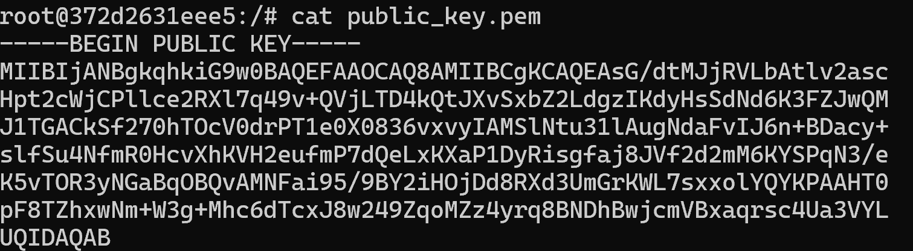

# Task 1: Public-key based authentication 
**Question 1**: 
Implement public-key based authentication step-by-step with openssl according the following scheme.


**Answer 1**:

Access to Docker and create to virtual server

We have two servers:

Alice: IP 10.9.0.5

Bob: IP 10.9.0.6


Update and install openssl 

```apt update && apt install -y openssl```

Create 2 keys (public & private) 

Alice create a private key

``` openssl genrsa -out private_key.pem 2048```

openssl: A command-line tool used for working with SSL/TLS and cryptography.

genrsa: Generates an RSA private key.

-out private_key.pem: Specifies where to save the generated private key, in this case, the file client_private_key.pem.

2048: The length (in bits) of the RSA key. 2048-bit is a common security standard.


Export Public key

```openssl rsa -in private_key.pem -pubout -out public_key.pem ```



openssl: A command-line tool used for working with SSL/TLS and cryptography.

rsa: A command used to process RSA keys.
-in client_private_key.pem: Specifies the file containing the previously generated RSA private key (in this case, client_private_key.pem).

-pubout: Indicates that you want to extract and output the public key from the private key.

-out public_key.pem: Specifies where to save the extracted public key (in this case, client_public_key.pem).

**Create a challenge message in Alice**

``` echo "challenge_message" > challenge.txt ```


``` openssl rsautl -encrypt -inkey client_public_key.pem -pubin -in challenge.txt -out encrypted_challenge.bin ```

rsautl: A command used to perform operations with RSA, including encryption and decryption.

-encrypt: This operation specifies that you want to encrypt the data.

-inkey client_public_key.pem: Specifies the file containing the RSA public key used to encrypt the data.

-pubin: Indicates that the input key is a public key. This helps OpenSSL understand that the key will be used for encryption.

-in challenge.txt: Specifies the file containing the data to be encrypted (in this case, challenge.txt).

-out encrypted_challenge.bin: Specifies the output file where the encrypted data will be stored (in this case, encrypted_challenge.bin).

**Send the client private key and the encrypted challenge message to the Bob**

``` docker cp 372d2631eee5:encrypted_challenge.bin E:\on\host\encrypted_challenge.bin```

``` docker cp E:\on\host\encrypted_challenge.bin 1abeab0ddca8:/encrypted_challenge.bin```

```docker cp E:\on\host\private_key.pem 1abeab0ddca8:/private_key.pem ```

```docker cp E:\on\host\private_key.pem 1abeab0ddca8:/private_key.pem ```

The result


**In bob**

``` openssl rsautl -decrypt -inkey private_key.pem -in encrypted_challenge.bin -out decrypted_challenge.txt ```

Sign challenge to encrypt

```openssl dgst -sha256 -sign client_private_key.pem -out signature.bin decrypted_challenge.txt```


Then send the signature from Bob back to Alice 


then Alice receive it


```openssl dgst -sha256 -verify public_key.pem -signature signature.bin decrypted_challenge.txt ```

**In Alice**

Decrypt the message

```openssl rsautl -decrypt -inkey private_key.pem -in encrypted_challenge.bin -out decrypted_challenge.txt```

Check file after decryption

``` cat decrypted_challenge.txt```


We can see the client can decrypt the challenge file we send them

# Task 2: Encrypting large message 
Create a text file at least 56 bytes.

**Question 1**:
Encrypt the file with aes-256 cipher in CFB and OFB modes. How do you evaluate both cipher as far as error propagation and adjacent plaintext blocks are concerned. 

**Answer 1**:
Create a text file 
```echo "This is a sample text file that is more than 56 bytes long for testing." > plaintext.txt```

Create Key and IV to conduct encryption and decryption

```openssl rand -hex 32 > key.txt ```

```openssl rand -hex 16 > iv.txt```

**Encrypt with CFB**

```openssl enc -aes-256-cfb -in plaintext.txt -out ciphertext_cfb.bin -K $(cat key.txt) -iv $(cat iv.txt)```

**Encrypt with OFB**

```openssl enc -aes-256-ofb -in plaintext.txt -out ciphertext_ofb.bin -K $(cat key.txt) -iv $(cat iv.txt)```

**Decrypt to check**

**CFB**

``` openssl enc -d -aes-256-cfb -in ciphertext_cfb.bin -out decrypted_cfb.txt -K $(cat key.txt) -iv $(cat iv.txt)```

**OFB**

``` openssl enc -d -aes-256-cfb -in ciphertext_ofb.bin -out decrypted_ofb.txt -K $(cat key.txt) -iv $(cat iv.txt)```


According to the theory: 
CFB Mode:

>The decrypted data contains errors (causing some characters to appear incorrectly).
> Possible reasons:
> 
> A small error in the encrypted data 
(ciphertext_cfb.bin) propagated during decryption because CFB mode depends on previous data (feedback mode).
>
>The IV or key might not match correctly.

OFB Mode (Output Feedback Mode):

> Decryption is successful and accurate.
>
> OFB mode does not depend on previous encrypted data, so it is less affected by errors in the data.

**Question 2**:
Modify the 8th byte of encrypted file in both modes (this emulates corrupted ciphertext).

Decrypt corrupted file, watch the result and give your comment on Chaining dependencies and Error propagation criteria.

**Answer 2**:

**Change 8th byte to conduct the test**

**CFB**

```dd if=/dev/zero bs=1 count=1 seek=7 conv=notrunc of=ciphertext_cfb.bin```

seek=7: Points to the 8th byte (since counting starts from 0).

count=1: Only modifies 1 byte.

if=/dev/zero: Writes a 0x00 byte (null byte) at that position.

**OFB**

```dd if=/dev/zero bs=1 count=1 seek=7 conv=notrunc of=ciphertext_ofb.bin```

Then we devrypt again to look the result


We can see with OFB there is only a little fault before "a" and the adjacent letters are not affected. Conversely, with OFB the plain text was change almost 20% of the adjacent (from after "sample" to before "is")

**CFB Mode**

Observation:

>An error in the 8th byte will affect the corresponding byte in the plaintext.
>
>The error will propagate and continue to impact subsequent bytes in the plaintext, due to CFB’s chaining dependencies.
>
>The plaintext after the error byte may become unreadable.

Evaluation:
>
> Error Propagation: Errors spread from the corrupted byte to all subsequent bytes.
>
> Chaining Dependencies: Depends on previous ciphertext bytes, increasing sensitivity to error

**OFB Mode**

Observed Phenomena:

> An error in the 8th byte only affects the 8th byte of the plaintext.
>
> Other bytes in the plaintext remain unaffected, as OFB does not have chaining dependencies.
> 
>Most of the plaintext remains readable, except for the erroneous byte.

Evaluations:
> Error Propagation: Does not spread, only affects the specific erroneous byte.
> 
> Chaining Dependencies: None, each byte of plaintext is decrypted independently.
